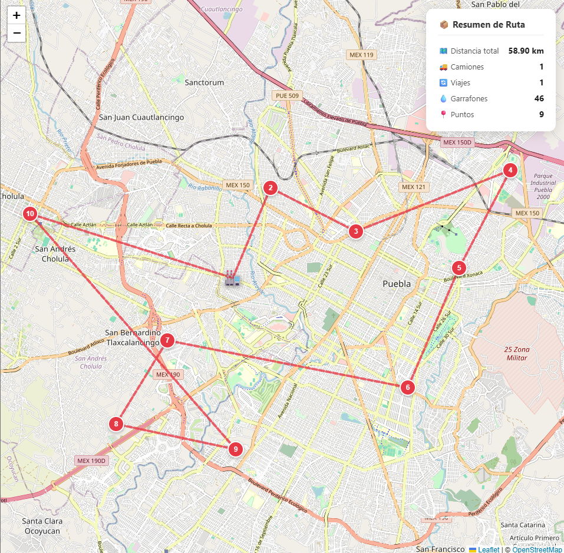

# 🗺️ Mapa Rutas — Visualizador de Rutas Optimizadas

Aplicación web construida con **Angular 20+** y **Leaflet** para visualizar rutas de entrega optimizadas sobre el mapa de Puebla, México. Diseñada para probar y depurar la salida de algoritmos de optimización de rutas (VRP / VRPTW).


---

## 📸 Vista previa

> El mapa muestra el almacén de origen, los puntos de entrega numerados en orden de visita y la línea de ruta trazada entre ellos. Cada viaje distinto aparece en un color diferente.

<p align="center">
  
</p>
---

## ✨ Funcionalidades

- 📍 Marcador especial para el **almacén / punto de partida**
- 🔢 Marcadores numerados por **orden de visita**
- 🎨 **Colores distintos** por viaje cuando hay múltiples camiones
- 📊 Panel lateral con **resumen de la ruta** (distancia, camiones, garrafones, etc.)
- 🗺️ Ajuste automático del zoom para encuadrar todos los puntos
- 💬 **Popups** en cada marcador con datos del paso (distancia, duración, carga)
- ⚡ Compatible con cualquier JSON que cumpla el formato `RutaData`

---

## 🛠️ Requisitos previos

| Herramienta | Versión mínima |
| ----------- | -------------- |
| Node.js     | 18.x           |
| pnpm        | 8.x            |
| Angular CLI | 17+            |

---

## 🚀 Instalación y uso

### 1. Clonar el repositorio

```bash
git clone https://github.com/Max-dev-Cc/mapa-rutas.git
cd mapa-rutas
```

### 2. Instalar dependencias

```bash
pnpm  install
```

### 3. Iniciar el servidor de desarrollo

```bash
ng serve --open
```

La app abrirá en `http://localhost:4200` automáticamente.

---

## 📂 Estructura del proyecto

```
src/
├── app/
│   ├── components/
│   │   └── mapa-rutas/
│   │       ├── mapa-rutas.ts       # Lógica del mapa (Leaflet)
│   │       ├── mapa-rutas.html     # Template + panel de resumen
│   │       └── mapa-rutas.scss     # Estilos del mapa y marcadores
│   ├── models/
│   │   └── ruta.ts                 # Interfaces TypeScript (DTOs)
│   └── app.ts                      # Componente raíz — aquí se inyectan los datos
├── styles.scss                     # Estilos globales
└── main.ts                         # Bootstrap de la aplicación
```

---

## 📋 Formato de datos (DTO)

La aplicación recibe un objeto `RutaData`. Puedes pegarlo directamente en `app.ts` o conectarlo a un endpoint HTTP.

```typescript
export interface RutaData {
  id_ruta: string;
  fecha_creacion: string;
  almacen: Almacen;
  puntos_entrega: PuntoEntrega[];
  capacidad_camion: number;
  num_camiones: number;
  hash_peticion: string;
  pasos_ruta?: PasoData[]; // La ruta optimizada (opcional)
  distancia_total: number;
  numero_viajes: number;
  total_garrafones: number;
}
```

### Tipos auxiliares

```typescript
export interface Almacen {
  latitud: number;
  longitud: number;
  tiempo_recarga: number; // segundos
}

export interface PuntoEntrega {
  id: number;
  nombre: string;
  latitud: number;
  longitud: number;
  garrafones: number;
  prioridad: number;
  ventana_tiempo_inicia?: number; // segundos desde medianoche
  ventana_tiempo_fin?: number;
  estado: string;
}

export interface PasoData {
  cliente_id: number; // 0 = almacén
  tipo: 'almacen' | 'entrega';
  lat: number;
  lon: number;
  distancia: number; // metros acumulados
  duracion: number; // segundos acumulados
  servicio: number; // segundos de servicio en el punto
  carga_camion: number; // garrafones restantes en el camión
}
```

---

## 🔌 Cómo usar tus propios datos

### Opción A — Hardcodear el JSON (más rápido para pruebas)

Abre `src/app/app.ts` y reemplaza el contenido del `signal<RutaData>(...)` con tu JSON:

```typescript
rutaData = signal<RutaData>({
  // 👇 Pega aquí la respuesta de tu API
  id_ruta: "...",
  almacen: { ... },
  puntos_entrega: [ ... ],
  pasos_ruta: [ ... ],
  ...
});
```

### Opción B — Consumir desde una API HTTP

1. Agrega `provideHttpClient()` en `main.ts`:

```typescript
import { bootstrapApplication } from '@angular/platform-browser';
import { provideHttpClient } from '@angular/common/http';
import { AppComponent } from './app/app';

bootstrapApplication(AppComponent, {
  providers: [provideHttpClient()],
}).catch(console.error);
```

2. Inyecta `HttpClient` en `app.ts`:

```typescript
import { Component, signal, inject, OnInit } from '@angular/core';
import { HttpClient } from '@angular/common/http';
import { RutaData } from './models/ruta';
import { MapaRutasComponent } from './components/mapa-rutas/mapa-rutas';

@Component({
  selector: 'app-root',
  standalone: true,
  imports: [MapaRutasComponent],
  template: `<app-mapa-rutas [rutaData]="rutaData()" />`,
})
export class AppComponent implements OnInit {
  private http = inject(HttpClient);
  rutaData = signal<RutaData | null>(null);

  ngOnInit(): void {
    this.http
      .get<RutaData>('https://tu-api.com/ruta/calcular')
      .subscribe((data) => this.rutaData.set(data));
  }
}
```

---

## 🎨 Colores de rutas

Cuando el resultado incluye múltiples viajes, cada uno recibe automáticamente un color de esta paleta:

| Viaje | Color      |
| ----- | ---------- |
| 1     | 🔴 Rojo    |
| 2     | 🔵 Azul    |
| 3     | 🟢 Verde   |
| 4     | 🟠 Naranja |
| 5     | 🟣 Morado  |
| 6+    | (cicla)    |

---

## ⚙️ Comportamiento del mapa

| Situación                | Comportamiento                                      |
| ------------------------ | --------------------------------------------------- |
| `pasos_ruta` presente    | Dibuja la ruta en el orden exacto de los pasos      |
| `pasos_ruta` ausente     | Dibuja solo los puntos de entrega sin línea de ruta |
| Múltiples viajes         | Cada viaje en su propio color                       |
| Puntos con mismas coords | Se solapan (limitación de los datos, no del mapa)   |

---

## 📦 Dependencias principales

| Paquete          | Uso                                    |
| ---------------- | -------------------------------------- |
| `@angular/core`  | Framework principal                    |
| `leaflet`        | Renderizado del mapa interactivo       |
| `@types/leaflet` | Tipos TypeScript para Leaflet          |
| OpenStreetMap    | Tiles del mapa (sin API key, gratuito) |

---

## 📝 Notas importantes

- El proyecto usa **Angular Standalone Components** (Angular 17+). No hay `NgModule`.
- El estado se maneja con **Signals** (`signal()`, `input()`).
- Los tiles del mapa provienen de **OpenStreetMap** y no requieren ninguna API key.
- El CSS de Leaflet **debe ir antes** que `styles.scss` en `angular.json` para evitar el bug de tiles fragmentados.

---

## 🤝 Contribuciones

Las contribuciones son bienvenidas. Por favor abre un _issue_ primero para discutir el cambio que deseas hacer.

---

## 📄 Licencia

MIT — libre para uso personal y comercial.
